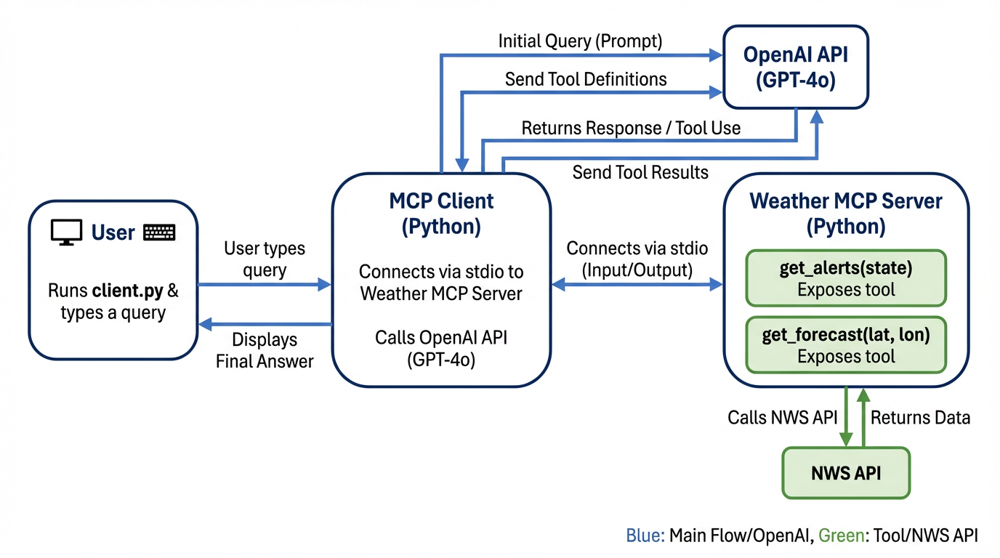

# 🌤️ MCP (Model Context Protocol)

A Python project that runs an **MCP client** (OpenAI-backed) and an **MCP weather server**, enabling intelligent conversations with an LLM that can call real-time weather tools (alerts and forecasts via the US National Weather Service).

## 📊 FlowChart



---

## 🏗️ Project Structure

| File | Purpose |
|------|---------|
| **`mcp/client.py`** | MCP client that connects to MCP servers over stdio and uses **OpenAI** (GPT-4o) to answer queries using the server's tools |
| **`Weather/src/weather.py`** | MCP server exposing weather tools |

### Weather Server Tools
- **`get_alerts(state)`** — Fetch weather alerts for a US state (e.g., `CA`, `NY`)
- **`get_forecast(latitude, longitude)`** — Retrieve forecast data for a specific location

---

## ⚙️ Setup

### 1️⃣ Clone and Enter the Project
```bash
cd /path/to/MCP
```

### 2️⃣ Create and Activate Virtual Environment
```bash
python3 -m venv .venv

# macOS/Linux
source .venv/bin/activate

# Windows
.venv\Scripts\activate
```

### 3️⃣ Install Dependencies
```bash
pip install -r requirements.txt
```

### 4️⃣ Configure API Key
Create a `.env` file in the project root:
```bash
OPENAI_API_KEY=your-openai-api-key
```

Or export it in your shell:
```bash
export OPENAI_API_KEY=your-openai-api-key
```

---

## 🚀 Running the Client

Connect the client to the weather server and start an interactive chat session.

```bash
python3 mcp/client.py /path/to/MCP/Weather/src/weather.py
```

**Quick Example** (from project root):
```bash
python mcp/client.py "$(pwd)/Weather/src/weather.py"
```

### 💬 Example Queries
At the `Query:` prompt, try asking:
- "What are the weather alerts for CA?"
- "What's the forecast for 37.77, -122.42?"
- "Are there any active weather warnings in New York?"

The client will call the MCP tools and return results from the weather server.

Type `quit` to exit the chat.

---

## 🤖 Using the Weather Server in Claude Desktop

Integrate the weather server with Claude Desktop so Claude can access the same tools.

Add the following to your Claude Desktop MCP config (`claude_desktop_config.json`):

```json
{
  "mcpServers": {
    "weather": {
      "command": "/path/to/MCP/.venv/bin/python",
      "args": ["/path/to/MCP/Weather/src/weather.py"]
    }
  }
}
```

**Note:** Replace `/path/to/MCP` with the absolute path to this project (e.g., `/Users/yourname/Desktop/MCP`).

---

## 📦 Requirements

- **Python 3.x**
- **Dependencies** (listed in `requirements.txt`):
  - `mcp`
  - `mcp[cli]`
  - `openai`
  - `python-dotenv`
  - `httpx`

---

## 📝 License

[Add your license here]

---

**Happy weather querying! 🌦️**